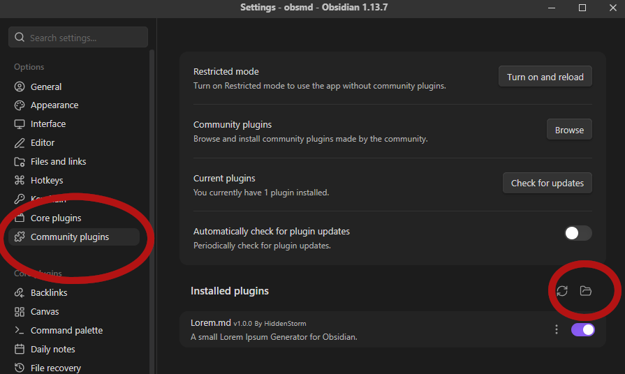

# Lorem.md

This is a small Lorem Ipsum generator for [Obsidian](https://obsidian.md).

## Installation
First grab the current release in the [releases tab](https://github.com/Hiddenstorm/Lorem.md/releases) and download lorem_vx_x_x.zip.
Next head to your obsidian settings and navigate to "Community plugins" and press the folder icon.

Next move the zip into this folder and unzip it so you have .obsidian/plugins/lorem_vx_x_x/{plugin files}.
That's it, now you're ready to use the plugin!

## Usage

Type !lorem and it will automatically add the default amount of 100 words to your document.

Or specify the amount of words to be added which is limited at 10.000.

